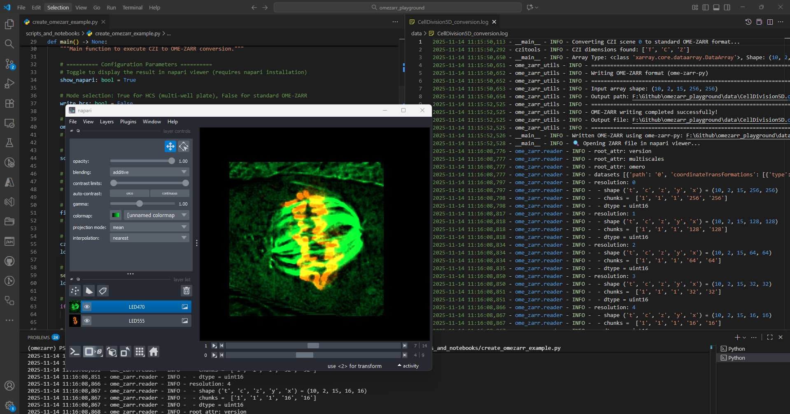
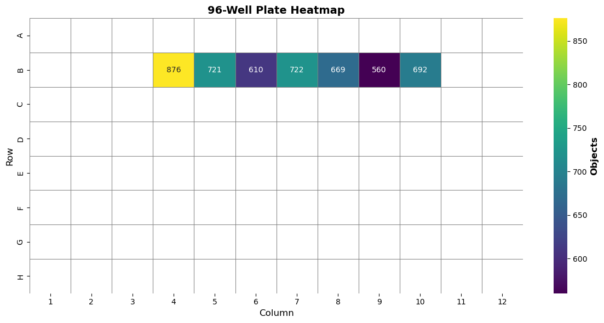

# CZI OME-ZARR Playground

This is a "playground" to try out and play with CZI image files and OME-ZARR related. It contains scripts and notebooks:



- convert CZI --> OME-ZARR using
  - [OME-ZARR](https://pypi.org/project/ome-zarr/) python package
  - [NGFF-ZARR](https://pypi.org/project/ngff-zarr/) python package
  - convert to "normal" OME-ZARR files or to OME-ZARR using the HCS layout (wellplates)
  - resulting images will be opened inside the [Napari Viewer](https://napari.org/stable/) using the [napari-ome-zarr](https://napari-hub.org/plugins/napari-ome-zarr.html) plugin
  - example CZI image data for both cases are provided - see "./data" folder
- the conversions can be test by running:
  - scripts
  - CMD tools
  - notebooks
- "analyze" HCS OME-ZARR by using simple processing functions
- visualize the results as an heatmap

## Disclaimer

This content of this repository is free to use for everybody and purely experimental. The authors undertakes no warranty concerning the use of those scripts or notebooks. Use them on your own risk.

**By using any of those examples you agree to this disclaimer.**

Playground to check out OME-ZARR related top

## Utilities: ome_zarr_utils.py

Collection of functions related to converting CZI to OME-ZARR

Example Usage:

```python
"""
Example script demonstrating CZI to OME-ZARR conversion.

This script provides examples for converting CZI (Carl Zeiss Image) files to OME-ZARR format
in two modes:
1. HCS (High Content Screening) format - for multi-well plate data
2. Standard OME-ZARR format - for single scene data

Supports two backend libraries:
- ome-zarr-py (OME_ZARR)
- ngff-zarr (NGFF_ZARR)
"""

import logging
from ome_zarr_utils import (
    convert_czi2hcs_omezarr,
    convert_czi2hcs_ngff,
    omezarr_package,
    write_omezarr,
    write_omezarr_ngff,
    setup_logging,
)
import ngff_zarr as nz
from pathlib import Path
from czitools.read_tools import read_tools
from typing import Optional


def main() -> None:
    """Main function to execute CZI to OME-ZARR conversion."""

    # ========== Configuration Parameters ==========
    # Toggle to display the result in napari viewer (requires napari installation)
    show_napari: bool = True

    # Mode selection: True for HCS (multi-well plate), False for standard OME-ZARR
    write_hcs: bool = False

    # Backend library selection: OME_ZARR (ome-zarr-py) or NGFF_ZARR (ngff-zarr)
    ome_package = omezarr_package.OME_ZARR
    # ome_package = omezarr_package.NGFF_ZARR

    # Scene ID for non-HCS format (ignored if write_hcs=True)
    scene_id: int = 0

    # ========== Input File Path ==========
    # Option 1: Use relative path to test data in repository
    # filepath: str = str(Path(__file__).parent.parent.parent / "data" / "WP96_4Pos_B4-10_DAPI.czi")

    # Option 2: Use absolute path to external test data
    filepath: str = r"F:\Github\omezarr_playground\data\CellDivision5D.czi"
    # filepath: str = r"F:\Github\omezarr_playground\data\WP96_4Pos_B4-10_DAPI.czi"

    # ========== Setup Logging (Master Log File) ==========
    czi_path = Path(filepath)
    log_file_path = czi_path.parent / f"{czi_path.stem}_conversion.log"

    # Configure logging explicitly - this will be the ONLY log file
    setup_logging(str(log_file_path), force_reconfigure=True)
    logger = logging.getLogger(__name__)

    # ========== Validate Input File ==========
    if not Path(filepath).exists():
        raise FileNotFoundError(f"CZI file not found: {filepath}")

    # ========== HCS Format Conversion ==========
    if write_hcs:
        logger.info(f"Converting CZI to HCS-ZARR format using {ome_package.name}...")

        if ome_package == omezarr_package.OME_ZARR:
            logger.info("Using ome-zarr package for HCS conversion...")
            zarr_output_path = convert_czi2hcs_omezarr(filepath, overwrite=True)

        elif ome_package == omezarr_package.NGFF_ZARR:
            logger.info("Using ngff-zarr package for HCS conversion...")
            zarr_output_path = convert_czi2hcs_ngff(filepath, overwrite=True)
        else:
            raise ValueError(f"Unsupported ome_package: {ome_package}")

        logger.info(f"Converted to OME-ZARR HCS format at: {zarr_output_path}")

        # Validate the HCS-ZARR file against OME-NGFF specification
        # This ensures proper metadata structure for multi-well plate data
        logger.info("Validating created HCS-ZARR file against schema...")
        _ = nz.from_hcs_zarr(zarr_output_path, validate=True)
        logger.info("Validation successful - HCS metadata conforms to specification.")

    # ========== Standard OME-ZARR Conversion (Non-HCS) ==========
    elif not write_hcs:
        logger.info(f"Converting CZI scene {scene_id} to standard OME-ZARR format...")

        # Read the CZI file as a 6D array with dimension order STCZYX(A)
        # S=Scene, T=Time, C=Channel, Z=Z-stack, Y=Height, X=Width
        array, mdata = read_tools.read_6darray(filepath, planes={"S": (scene_id, scene_id)}, use_xarray=True)

        # Extract the specified scene (remove Scene dimension to get 5D array)
        # write_omezarr requires 5D array (TCZYX), not 6D (STCZYX)
        array = array.squeeze("S")  # Remove the Scene dimension
        logger.info(f"Array Type: {type(array)}, Shape: {array.shape}, Dtype: {array.dtype}")

        if ome_package == omezarr_package.OME_ZARR:
            # Generate output path with .ome.zarr extension
            zarr_output_path: Path = Path(str(filepath)[:-4] + ".ome.zarr")

            # Write OME-ZARR using ome-zarr-py backend
            zarr_output_path: Optional[str] = write_omezarr(
                array, zarr_path=str(zarr_output_path), metadata=mdata, overwrite=True
            )
            logger.info(f"Written OME-ZARR using ome-zarr-py: {zarr_output_path}")

        elif ome_package == omezarr_package.NGFF_ZARR:
            # Generate output path with _ngff.ome.zarr extension
            zarr_output_path: Path = Path(str(filepath)[:-4] + "_ngff.ome.zarr")

            # Write OME-ZARR using ngff-zarr backend with multi-resolution pyramid
            # scale_factors=[2, 4] creates 3 resolution levels (1x, 2x, 4x downsampled)
            _ = write_omezarr_ngff(array, zarr_output_path, mdata, scale_factors=[2, 4], overwrite=True)
            logger.info(f"Written OME-ZARR using ngff-zarr: {zarr_output_path}")
        else:
            raise ValueError(f"Unsupported ome_package: {ome_package}")

    # ========== Optional: Visualize in napari ==========
    # Open the converted ZARR file in napari viewer for interactive visualization
    if show_napari:
        try:
            import napari

            logger.info("🔍 Opening ZARR file in napari viewer...")
            viewer = napari.Viewer()
            viewer.open(zarr_output_path, plugin="napari-ome-zarr")
            napari.run()
        except ImportError:
            logger.warning("⚠️ napari is not installed. Skipping visualization.")
            logger.info("💡 Install with: pip install napari[all] napari-ome-zarr")


if __name__ == "__main__":
    main()
```

## Convert CZI to OME-ZARR: convert2omezarr.py

The tool can be used from the commandline:

```bash
python convert2omezarr.py --czifile ../data/CellDivision5D.czi --use_ngffzarr --scales [2,4] --overwrite
```

General Usage Instructions:

```txt
usage: convert2omezarr.py [-h] --czifile CZIFILE [--use_ngffzarr | --use_omezarr] [--zarr ZARR] [--scales SCALES] [--overwrite] [--validate] [--scene SCENE]

Convert CZI files to OME-ZARR format

options:
  -h, --help         show this help message and exit
  --czifile CZIFILE  Path to the input CZI file to convert (required)
  --use_ngffzarr     Use NGFF-ZARR package
  --use_omezarr      Use OME-ZARR package
  --zarr ZARR        Output path for the OME-ZARR file (default: <czifile>_ngff_plate.ome.zarr)
  --scales SCALES    Multiscale downsampling factors as JSON-style list (default: [1,2,4]). Example: --scales [2,4,8]
  --overwrite        Overwrite existing OME-ZARR files if they exist (default: False)
  --validate         Validate the output OME-ZARR files (default: False)
  --scene SCENE      Scene index to process (default: 0)

Examples:
    # Basic conversion with default NGFF-ZARR format and default scales
    python convert2omezarr.py --czifile myimage.czi

    # Use specific multiscale factors
    python convert2omezarr.py --czifile myimage.czi --scales [2,4,8]

    # Use OME-ZARR format explicitly with custom scales
    python convert2omezarr.py --czifile myimage.czi --use_omezarr --scales [1,2,4,8]

    # Use NGFF-ZARR format explicitly
    python convert2omezarr.py --czifile myimage.czi --use_ngffzarr --scales [2,4]

    # Specify custom output path and scales
    python convert2omezarr.py --czifile myimage.czi --zarr /path/to/output.ome.zarr --scales [1,2,4]

    # Enable overwrite mode to replace existing files
    python convert2omezarr.py --czifile myimage.czi --overwrite --scales [2,4,8,16]

Notes:
    - If no format is specified, NGFF-ZARR format is used by default (recommended)
    - Scales must be specified as a list in brackets: [2,4,8] or [1,2,4]
    - The output format follows the OME-NGFF specification
    - All conversion logs are saved to '<input_filename>_hcs_omezarr.log'
```

## Convert CZI from a Wellplate to HCS OME-ZARR: convert2hcs_omezarr.py

General Usage Instructions:

```bash
python convert2hcs_omezarr.py --czifile ../data/WP96_4Pos_B4-10_DAPI.czi --use_ngffzarr --plate "MyPlate" --overwrite
```

Usage:

```txt
usage: convert2hcs_omezarr.py [-h] --czifile CZIFILE [--use_ngffzarr | --use_omezarr] [--zarr ZARR] [--plate PLATE] [--overwrite] [--validate]

Convert CZI files to OME-ZARR HCS (High Content Screening) format

options:
  -h, --help         show this help message and exit
  --czifile CZIFILE  Path to the input CZI file to convert (required)
  --use_ngffzarr     Use NGFF-ZARR format to create the HCS Plate Layout (recommended)
  --use_omezarr      Use OME-ZARR format to create the HCS Plate Layout
  --zarr ZARR        Output path for the OME-ZARR file (default: <czifile>_ngff_plate.ome.zarr)
  --plate PLATE      Name of the well plate for metadata (default: 'Automated Plate')
  --overwrite        Overwrite existing OME-ZARR files if they exist (default: False)
  --validate         Validate the output OME-ZARR files (default: False)

Examples:
    # Basic conversion with default NGFF-ZARR format
    python convert2hcs_omezarr.py --czifile WP96_plate.czi

    # Use OME-ZARR format explicitly
    python convert2hcs_omezarr.py --czifile WP96_plate.czi --use_omezarr

    # Use NGFF-ZARR format explicitly
    python convert2hcs_omezarr.py --czifile WP96_plate.czi --use_ngffzarr

    # Specify custom output path and plate name
    python convert2hcs_omezarr.py --czifile WP96_plate.czi --zarr /path/to/output.ome.zarr --plate "Experiment_001"

    # Enable overwrite mode to replace existing files
    python convert2hcs_omezarr.py --czifile WP96_plate.czi --overwrite

Notes:
    - If no format is specified, NGFF-ZARR format is used by default (recommended)
    - The output format follows the OME-NGFF specification for HCS data
    - Data is organized in a plate/well/field hierarchy
    - All conversion logs are saved to '<input_filename>_hcs_omezarr.log'
```

### CZI - Normal Conversion Example Notebook

The process of converting an CZI to a normal OME-ZARR is explained in more detail here:

Jupyter Notebook - Conversion: [convert_czi2hcs_omezarr.ipynb](scripts/convert_czi2_omezarr.ipynb)

### CZI - HCS Conversion Example Notebook

The process of converting an CZI to a HCS OME-ZARR is explained in more detail here:

Jupyter Notebook - HCS Conversion: [convert_czi2hcs_omezarr.ipynb](scripts/convert_czi2hcs_omezarr.ipynb)

## Analyze and HCS OME-ZARR

After the conversion it is very straight forward to analyze the resulting HCS OME-ZARR.

Jupyter Notebook - Image Analysis: [process_omezarr_HCS_plate.ipynb](scripts/process_omezarr_HCS_plate.ipynb)

The final result for that example is this heatmap:

