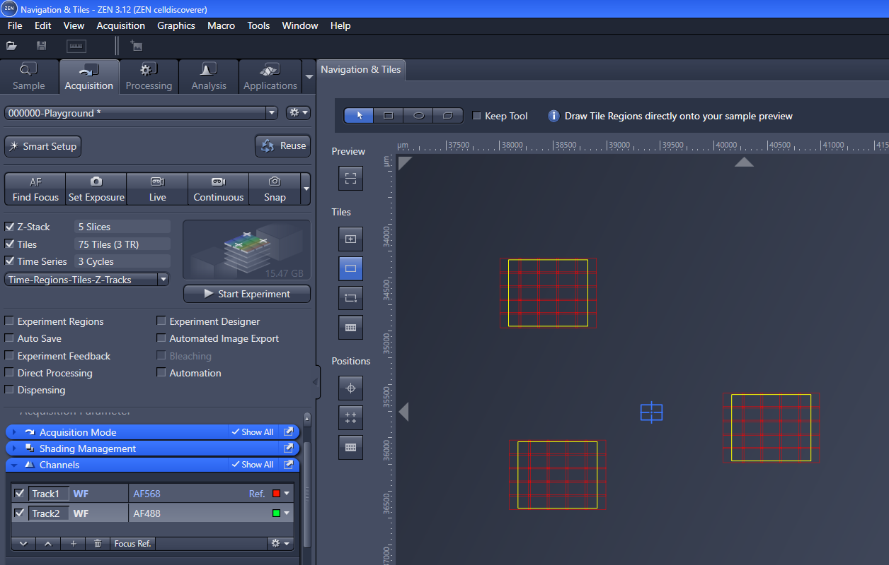
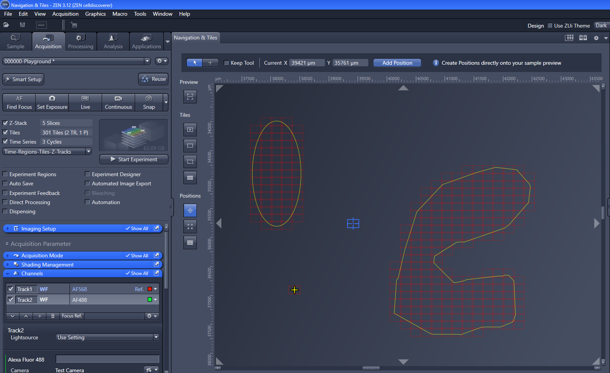
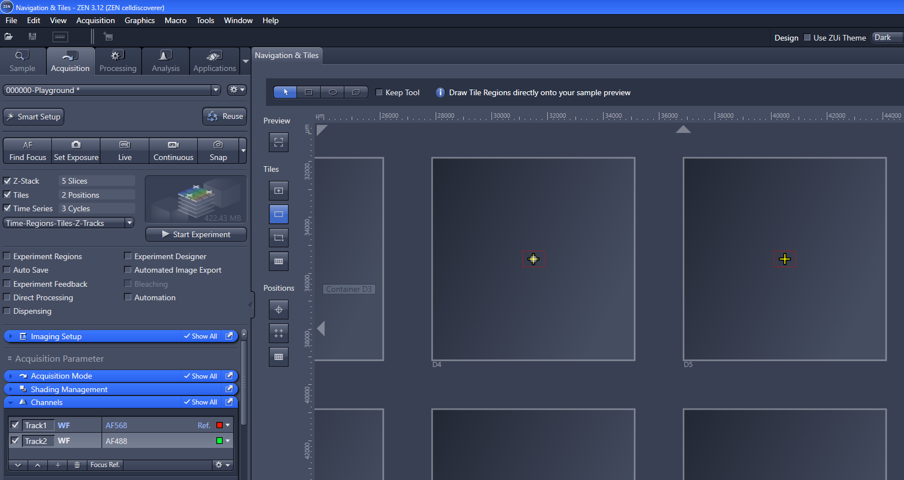
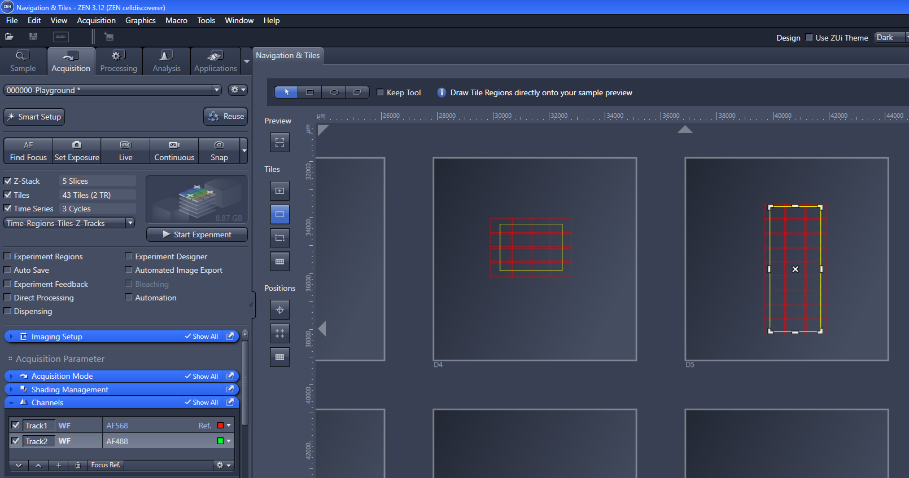

# CZI to OME-ZARR Mapping 

## Single Positions or Tile regions

- that is the straight-foreword use case :-)

## Multiple Scenes with identical shape

## Multiple Scenes with different shapes

## Single Position per Well

## Single TileRegions per Well

## Different TileRegions per Well

